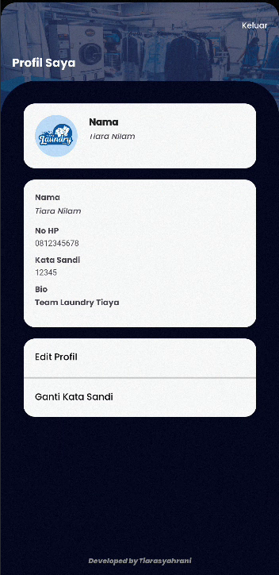

# 🧺 Aplikasi Laundry Android

Aplikasi Laundry ini dirancang untuk membantu pengelolaan usaha laundry secara praktis dan efisien. Mulai dari proses login hingga pencetakan laporan, aplikasi ini menyediakan berbagai fitur penting yang dibutuhkan oleh pemilik maupun karyawan laundry.

---

## ✨ Fitur Utama

- **Login & Register**  
  Sistem autentikasi pengguna yang aman untuk mengakses aplikasi.

- **Transaksi**  
  Mencatat orderan pelanggan, layanan yang dipilih, status laundry, dan total pembayaran.

- **Pelanggan**  
  Menyimpan data pelanggan, seperti nama, alamat, no hp, dll

- **Laporan**  
  Menampilkan laporan transaksi secara harian, mingguan, atau bulanan.

- **Pegawai**  
  Manajemen data pegawai yang bekerja di outlet laundry.

- **Layanan**  
  Menyediakan daftar layanan laundry seperti cuci kering, setrika, kiloan, dan satuan.

- **Tambahan**  
  Layanan tambahan seperti parfum khusus, antar-jemput, atau pembungkus eksklusif.

- **Akun**  
  Pengaturan profil pengguna, kata sandi, dan preferensi lainnya.

- **Cabang**  
  Mendukung multi-cabang/outlet laundry dengan sistem yang terintegrasi.

- **Printer**  
  Integrasi dengan printer thermal via Bluetooth untuk cetak struk transaksi pelanggan.

---

## 📸 Tampilan Aplikasi

| | |
|---|---|
|  |  |
|  |  |
|  |  |
|  |  |
|  |  |
|  |  |
|  |  |
|  |  |
|  |  |
|  |  |
|  |  |
|  |  |
|  |  |
|  |  |
|  |  |
|  |  |
|  |  |
|  |  |
|  |  |
|  |  |
|  |  |
|  |  |

---

## 🛠️ Teknologi yang Digunakan

- **Android Studio (Java/Kotlin)**
- **Firebase Authentication / Firestore / Realtime Database** *(jika online)*
- **Printer Thermal Bluetooth (Opsional)**
- **Glide** (untuk loading gambar)
- **Retrofit** (untuk API, jika digunakan)

---

## ⚙️ Cara Install & Menjalankan

1. Clone repositori ini:
   ```bash
   git clone https://github.com/tiarasyahrani/laundry.git
2. Buka project di Android Studio.
3. Jalankan Sync Gradle.
4. Sambungkan emulator atau HP.
5. Jalankan aplikasi.

Nama: [Tiarasy]

Email:tiaranilam1178@gmail.com@email.co

Instagram: @craazsy_t
